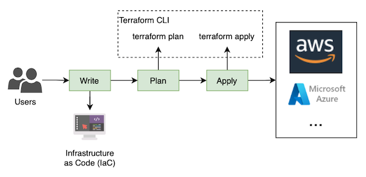
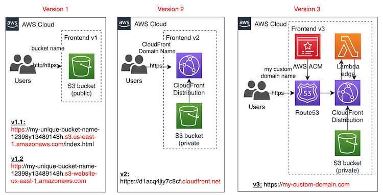

# aws-terraform-serverless-website

This code has been created to write the following article:

The article tries to explain how Terraform works: <https://www.playingaws.com/posts/how-to-deploy-serverless-website-with-terraform/>

And show different options to deploy a serverless website on AWS:

- **v1.1**: public S3 bucket
  - **Advantage**: easy to implement
  - **Disadvantages**: no custom domain, no aligned with security best practices (public bucket), no cache for static files
- **v1.2**: public S3 as `Static website hosting`
  - **Advantages**: easy to implement, index document and error page, redirection rules
  - **Disadvantages**: not aligned with security best practices (public bucket), no cache for static files, Amazon S3 website endpoints do not support HTTPS (if you want to use HTTPS, you can use Amazon CloudFront to serve a static website hosted on Amazon S3)
- **v2**: CloudFront distribution + private S3 bucket
  - **Advantages**: easy to implement, private s3 bucket, cache for static files
  - **Disadvantages**: auto-generated domain name
- **v3**: Route53 + ACM + CloudFront Distribution + private S3 bucket + optionally Lambda Edge
  - **Advantages**: custom domain name using AWS managed certificates, private s3 bucket, cache for static files
  - **Disadvantages**: more complex to implement
