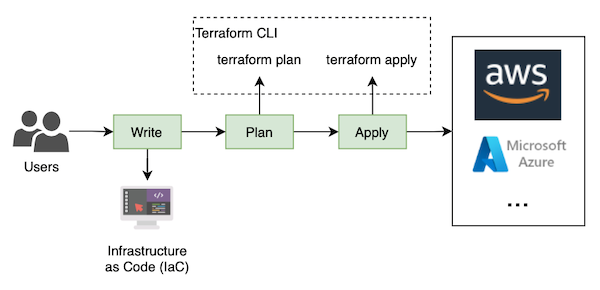

# aws-terraform-serverless-website

- [aws-terraform-serverless-website](#aws-terraform-serverless-website)
  - [Introduction](#introduction)
  - [Version 1.1](#version-11)
  - [Version 1.2](#version-12)
  - [Version 2](#version-2)
  - [Version 3](#version-3)
  - [Autogenerated-documentation](#autogenerated-documentation)
    - [Requirements](#requirements)
    - [Providers](#providers)
    - [Modules](#modules)
    - [Resources](#resources)
    - [Inputs](#inputs)
    - [Outputs](#outputs)

## Introduction

This code has been created to explain how Terraform works in the following article of my blog <https://www.playingaws.com/posts/how-to-deploy-serverless-website-with-terraform/>

And show different options to deploy a serverless website on AWS:

## Version 1.1

public S3 bucket

- **Advantage**: easy to implement
- **Disadvantages**: no custom domain, no aligned with security best practices (public bucket), no cache for static files

## Version 1.2

public S3 as `Static website hosting`

- **Advantages**: easy to implement, index document and error page, redirection rules
- **Disadvantages**: not aligned with security best practices (public bucket), no cache for static files, Amazon S3 website endpoints do not support HTTPS (if you want to use HTTPS, you can use Amazon CloudFront to serve a static website hosted on Amazon S3)

## Version 2

CloudFront distribution + private S3 bucket

- **Advantages**: easy to implement, private s3 bucket, cache for static files
- **Disadvantages**: auto-generated domain name

## Version 3

Route53 + ACM + CloudFront Distribution + private S3 bucket + optionally Lambda Edge

- **Advantages**: custom domain name using AWS managed certificates, private s3 bucket, cache for static files
- **Disadvantages**: more complex to implement

## Autogenerated-documentation

Terraform-docs (https://terraform-docs.io/) has been used to autogenerate the below documentation.

Here, in the main folder, there are no terraform files, you have to check inside the `versions` folder.

<!-- BEGIN_TF_DOCS -->
### Requirements

No requirements.

### Providers

No providers.

### Modules

No modules.

### Resources

No resources.

### Inputs

No inputs.

### Outputs

No outputs.
<!-- END_TF_DOCS -->