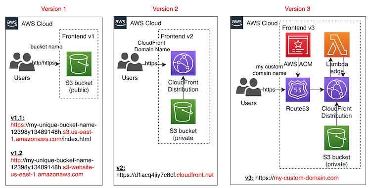

# aws-terraform-serverless-website

Different options to deploy a serverless website on AWS:

## Version 2

CloudFront distribution + private S3 bucket

- **Advantages**: easy to implement, private s3 bucket, cache for static files
- **Disadvantages**: auto-generated domain name

## Autogenerated-documentation

Terraform-docs (https://terraform-docs.io/) has been used to autogenerate the below documentation.

<!-- BEGIN_TF_DOCS -->
### Requirements

No requirements.

### Providers

| Name | Version |
|------|---------|
|  [aws](#provider\_aws) | n/a |

### Modules

No modules.

### Resources

| Name | Type |
|------|------|
| [aws_cloudfront_distribution.cdn_static_site](https://registry.terraform.io/providers/hashicorp/aws/latest/docs/resources/cloudfront_distribution) | resource |
| [aws_cloudfront_origin_access_control.default](https://registry.terraform.io/providers/hashicorp/aws/latest/docs/resources/cloudfront_origin_access_control) | resource |
| [aws_s3_account_public_access_block.website_bucket](https://registry.terraform.io/providers/hashicorp/aws/latest/docs/resources/s3_account_public_access_block) | resource |
| [aws_s3_bucket.website_bucket](https://registry.terraform.io/providers/hashicorp/aws/latest/docs/resources/s3_bucket) | resource |
| [aws_s3_bucket_policy.website_bucket_policy](https://registry.terraform.io/providers/hashicorp/aws/latest/docs/resources/s3_bucket_policy) | resource |
| [aws_s3_object.website_bucket](https://registry.terraform.io/providers/hashicorp/aws/latest/docs/resources/s3_object) | resource |
| [aws_iam_policy_document.website_bucket](https://registry.terraform.io/providers/hashicorp/aws/latest/docs/data-sources/iam_policy_document) | data source |

### Inputs

No inputs.

### Outputs

| Name | Description |
|------|-------------|
|  [cloudfront\_url](#output\_cloudfront\_url) | n/a |
<!-- END_TF_DOCS -->